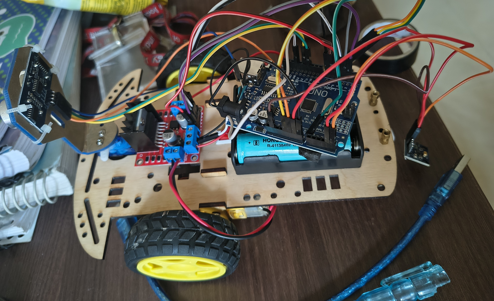
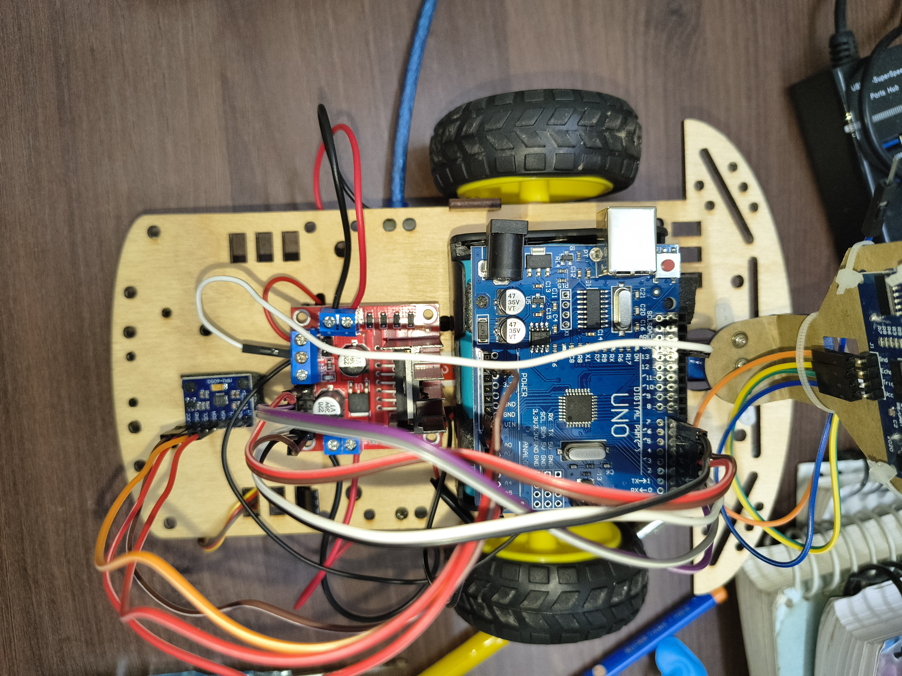
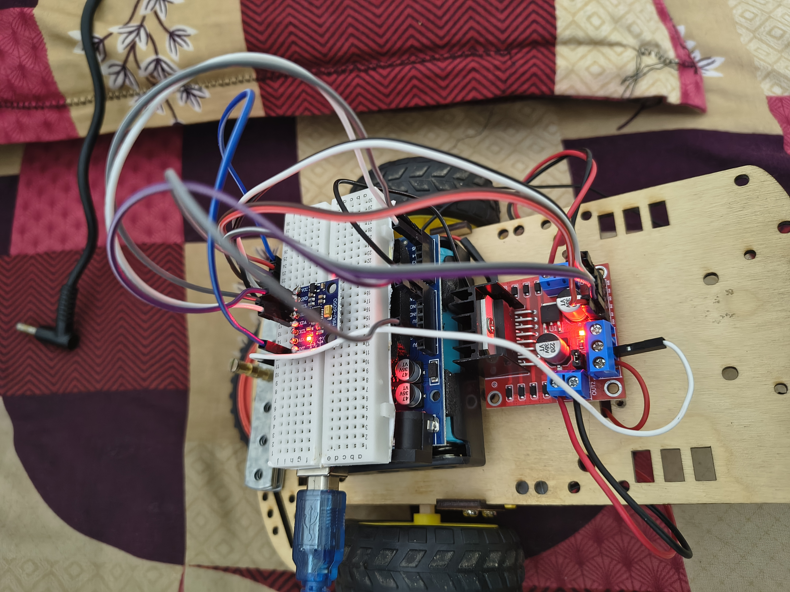
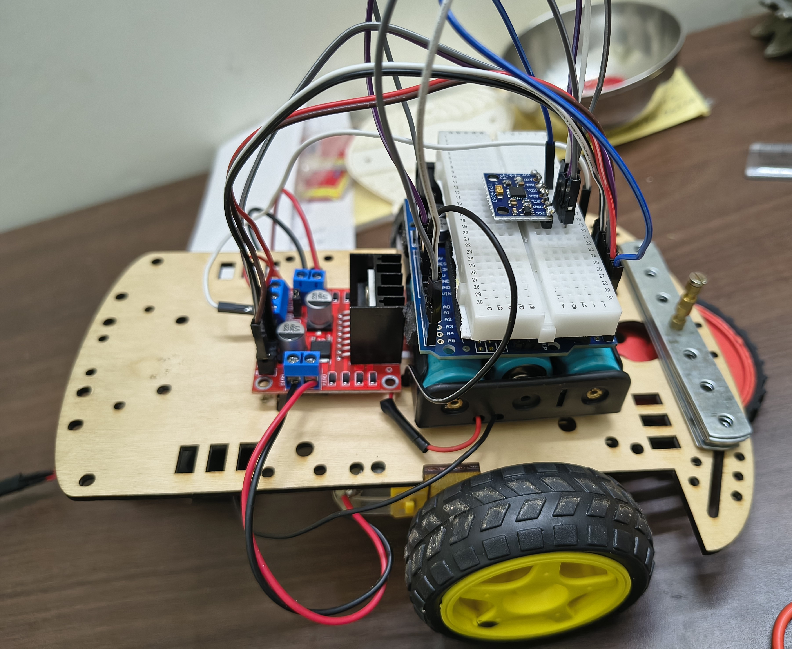

# Two-Wheeled Self-Balancing Robot

## Overview

This project presents the design and development of a two-wheeled self-balancing robot for studying real-time control and stabilization. A unique aspect of this work is that the robot was initially built as a three-wheeled platform and later converted into a two-wheeled configuration by removing the front wheel. The center of gravity (CG) was carefully adjusted to lie between the two drive wheels, enabling the robot to achieve preliminary balance before implementing active control.

The hardware architecture consists of an Arduino-based controller, DC motors, a motor driver, batteries, and an IMU sensor for orientation feedback. A PID control algorithm was implemented to continuously minimize balancing errors and maintain dynamic stability. Sensor calibration, controller tuning, and experimental validation were performed to optimize the system's performance and achieve robust self-balancing behavior.

---

## Features

* Conversion of a three-wheeled robot into a two-wheeled self-balancing platform.
* Center of gravity optimization for passive balancing.
* Arduino-based control architecture.
* Real-time orientation feedback using an IMU sensor.
* PID-based dynamic stabilization.
* Sensor calibration and controller tuning.
* Experimental validation and performance optimization.

---

## Hardware Components

| Component           | Description                                  |
| ------------------- | -------------------------------------------- |
| Arduino Uno         | Main controller                              |
| IMU Sensor          | Orientation and angular velocity measurement |
| DC Geared Motors    | Actuation system                             |
| Motor Driver        | Motor control interface                      |
| Batteries           | Power supply                                 |
| Chassis             | Mechanical structure                         |
| Switches and Wiring | Power distribution and connections           |

---

## Working Principle

The robot continuously measures its tilt angle and angular motion using an IMU sensor. These measurements are processed by the Arduino controller, which executes a PID control algorithm to determine the required motor commands. The motor driver actuates the DC motors to correct any deviation from the upright position and maintain dynamic stability in real time.

---

## Control Algorithm

The self-balancing mechanism is based on a Proportional-Integral-Derivative (PID) controller.

The controller:

* Detects the deviation from the vertical position.
* Calculates the corrective action.
* Drives the motors to reduce balancing errors.
* Maintains stability under small disturbances.

Controller gains were experimentally tuned to improve response and robustness.

---

## Experimental Results

* Successfully converted a three-wheeled robot into a two-wheeled self-balancing system.
* Achieved stable balancing through center of gravity optimization.
* Implemented IMU-based feedback control.
* Obtained reliable self-balancing performance using PID control.
* Improved stability through sensor calibration and iterative controller tuning.

---

## Images

### Initial Three-Wheeled Platform



### Two-Wheeled Configuration



### Electronics and Assembly



### Final Prototype



---

## Demonstration Video

[Watch the Self-Balancing Robot Demo](video/self_balancing_robot.mp4)

---

## Repository Structure

```text
Two-Wheeled-Self-Balancing-Robot
│
├── Arduino_Code
│   └── Self_Balancing_Robot.ino
│
├── images
│   ├── SBR1.jpg
│   ├── SBR2.jpg
│   ├── SBR3.jpg
│   ├── SBR4.jpg
│   ├── SBR5.jpg
│   ├── SBR6.jpg
│   └── SBR7.jpg
│
├── video
│   └── final_self_balancing.mp4
│
└── README.md
```

---

## Future Improvements

* Implementation of advanced control algorithms such as LQR or Kalman filtering.
* Wireless monitoring and control.
* Integration with ROS for autonomous applications.
* Improved mechanical design and weight optimization.
* Addition of obstacle detection and navigation capabilities.

---

## Author

**Rohit**

M.Tech in Advanced Manufacturing and Design.
Mechanical Engineering.
IIT Jodhpur
